# FIREFLY

**Fluorescence Inference & Reconstruction Engine — Framework for Localization Yields**


A single-particle tracking PALM / dSTORM analysis pipeline for `.czi` (Zeiss)
and `.tif` / `.tiff` image stacks. Localisation, linking, MSD / diffusion /
motion-class analysis, JDD, dwell-time, MSS, DBSCAN clustering, redundant-
cross-correlation drift correction, turning-angle and radial-distribution
analysis, plus a multi-group comparison mode with statistical tests and a
multi-page PDF report.

FIREFLY offers **five detection engines** — trackpy and PyTorch (both
Crocker-Grier-family centroid localisers, calibrated to agree to within the
experiment's noise floor), an **à trous wavelet** detector for faint spots in
low-SNR / structured backgrounds, and two alternative GPU sub-pixel refiners,
**Gaussian MLE** (maximum-likelihood 2-D Gaussian fit) and **radial symmetry**
(Parthasarathy 2012, closed-form) — which re-fit each spot's centre and match the
centroid localisers closely on isolated spots, with small gains at low SNR.
Linking offers **six trajectory linkers** — Crocker–Grier (Trackpy, default),
Kalman filter (TrackMate Linear Motion), Jaqaman LAP (TrackMate, with an
optional merge/split variant), nearest-neighbour, and a palmTRACER-inspired
simulated-annealing tracker — plus an optional **auto search-range** that picks
the linking distance from the data. You can also **import and analyse
localisation tables exported by other tools** (TrackMate, palmTRACER,
Picasso, ThunderSTORM) — see [Analyse external localisations](#analyse-external-localisations).

Built with Python + PySide6 (Qt 6 / QML); the interactive viewers (Visualise
tab + ROI editor) are bespoke QGraphicsView / QImage widgets — no napari.
Localisation runs on the GPU via PyTorch — NVIDIA CUDA on Windows/Linux, Apple
MPS on macOS, picked automatically — and falls back to the parallel PyTorch-CPU
path when no healthy GPU is available. Trackpy remains a manual option and the
last-resort fallback when PyTorch is not installed.

By Jacob Levers · Apple-Silicon macOS and Windows

---

## Table of contents

1. [Installation](#installation)
   - [Standalone app (recommended)](#standalone-app-recommended)
   - [From source (advanced)](#from-source-advanced)
2. [Quick tour](#quick-tour)
3. [Features](#features)
4. [Workflow](#workflow)
   - [Analyse a sample](#analyse-a-sample)
   - [Analyse external localisations](#analyse-external-localisations)
   - [Batch a folder](#batch-a-folder)
   - [Compare groups](#compare-groups)
   - [Visualise tracks](#visualise-tracks)
5. [Outputs](#outputs)
6. [Performance notes](#performance-notes)
7. [Troubleshooting](#troubleshooting)
8. [Acknowledgements](#acknowledgements)

---

## Installation

### Standalone app (recommended)

No Python installation required. Pre-built binaries are attached to each
release on the [Releases page](https://github.com/jacob-levers/FIREFLY/releases).

**macOS — Apple Silicon (M-series)**

1. Download `FIREFLY-macOS-arm64.dmg` from the latest release.
2. Double-click the `.dmg` to mount it.
3. Drag `FIREFLY.app` into `/Applications`.
4. First launch: right-click → **Open** if macOS warns that the developer
   can't be verified, then **Open anyway**.

> The pre-built macOS app is arm64 (M1 and later). Intel Macs do not have a
> supported pre-built installer yet; use the source path below if you need to
> run FIREFLY there.

**Windows**

1. Download `FIREFLY-Windows.exe` from the latest release.
2. Double-click to launch. First launch unpacks bundled libraries to
   `%LOCALAPPDATA%\FIREFLY\bundle` — this can take a few minutes the first
   time while antivirus scans the fresh binaries; later launches are quick.

> **GPU acceleration on Windows:** the bundled `FIREFLY-Windows.exe`
> ships **CPU-only** PyTorch (the CUDA-enabled torch wheel is ~2.5 GB and
> pushes the .exe past GitHub Releases' 2 GiB asset cap, so it can't be
> bundled). If you have an NVIDIA GPU, open **Preferences → GPU
> acceleration** and click **Install CUDA** — FIREFLY downloads the CUDA
> torch build matched to your GPU + interpreter and prompts a restart, all
> in-app. (Source installs can instead use the manual step under **"From
> source (advanced)"** below.) macOS Apple-Silicon users already get MPS
> acceleration from the bundled torch — no extra setup needed.

### Updating

FIREFLY checks GitHub for new releases on launch. When one is available an
**Update available** pill appears in the header — click it (it jumps straight to
**Preferences → Updates**) and choose **Download & install**. The app downloads
the new version, replaces itself, and restarts automatically — no need to
re-download from the Releases page by hand. On macOS the first launch after an
update no longer needs the right-click → **Open** step. Source installs update
with `git pull`; the launcher checks the project's dependency fingerprint and
reconciles the local environment before it starts FIREFLY.

### From source (advanced)

Python 3.10 or newer. Clone the repo and run the launcher for your OS — it
sets up a virtual environment, installs dependencies, and starts the app.

```bash
git clone https://github.com/jacob-levers/FIREFLY.git
cd FIREFLY
```

**macOS** — double-click `Launch_FIREFLY.app`.

**Windows** — double-click `Launch_FIREFLY.bat`.

First launch opens a terminal showing pip installing PySide6, PyTorch,
scipy and friends (~3–8 minutes). The GUI starts automatically when the
install finishes. After `git pull`, the launcher also reconciles a changed
dependency set before launching; ordinary source edits do not reinstall it.

**Enabling CUDA (Windows + NVIDIA GPU)**

The default `pip install torch` on Windows pulls the CPU-only wheel.
To get a CUDA-enabled torch, run *after* the first-launch install
finishes (still inside the project's virtual environment):

```powershell
.\sptpalm-env\Scripts\python.exe -m pip install --upgrade --index-url https://download.pytorch.org/whl/cu124 "torch>=2.6,<3"
```

Restart FIREFLY. The backend dropdown in the parameter sidebar will pick up
CUDA automatically; `Backend: torch (device: cuda)` should appear in
the log when a run starts. cu124 needs an NVIDIA driver ≥ R535
(Aug 2023); for older drivers swap `cu124` for `cu121` or `cu118`.

---

## Quick tour

The app opens on a welcome page with four action cards:

| Card | Workflow |
|---|---|
| **Analyse a sample** | Run the full pipeline on one `.czi` / `.tif` file |
| **Batch a folder** | Process every file in a folder — in parallel on capable machines (HYPER-FLY) |
| **Compare & analyse** | Drop 2–12 conditions into one live comparison — figure, stats and significance |
| **Visualise tracks** | Open a previous run in the interactive track / cluster viewer |

Once you pick a card the welcome page is replaced by the workflow tabs
(**Import / Process / Analysis / Visualise / HYPER-FLY**) plus a sidebar of
analysis parameters. **Process** is the live run cockpit; **Analysis** is the
merged comparison + results workspace (multi-condition figures, statistics and
significance, updated live as you add data); **HYPER-FLY** is the parallel-batch
dashboard (active only during a parallel batch). Figure styling lives in
**Preferences** — the cogwheel in the header. The landing page is shown only at
launch, not on every tab switch.

### The workflow, tab by tab

**Import** — configure the analysis in the parameter sidebar, drop in a recording,
preview detection and draw a region of interest.

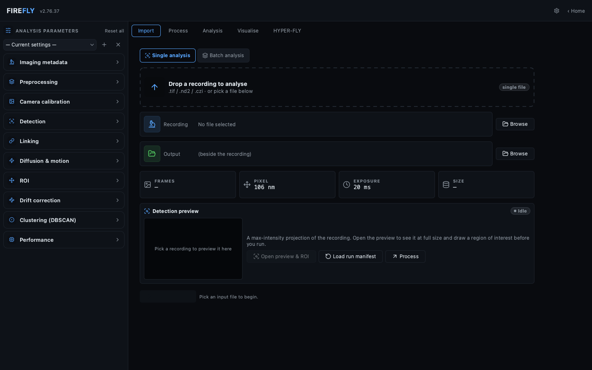

**Process** — the live run cockpit: a connected pipeline stepper, live detection
preview, localisation-mass histogram and resource meters.

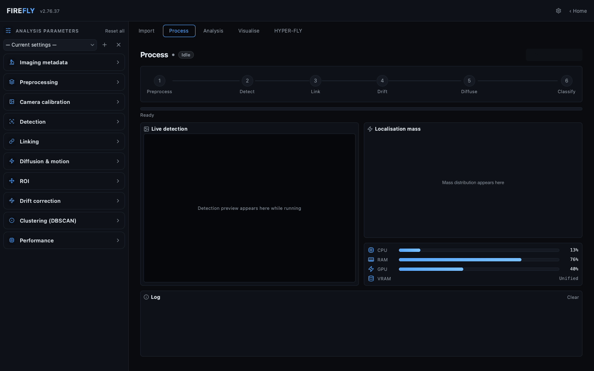

**Analysis** — drop 2–12 conditions into one live comparison; the figure,
statistics and significance update as you add data — no "Generate" step.

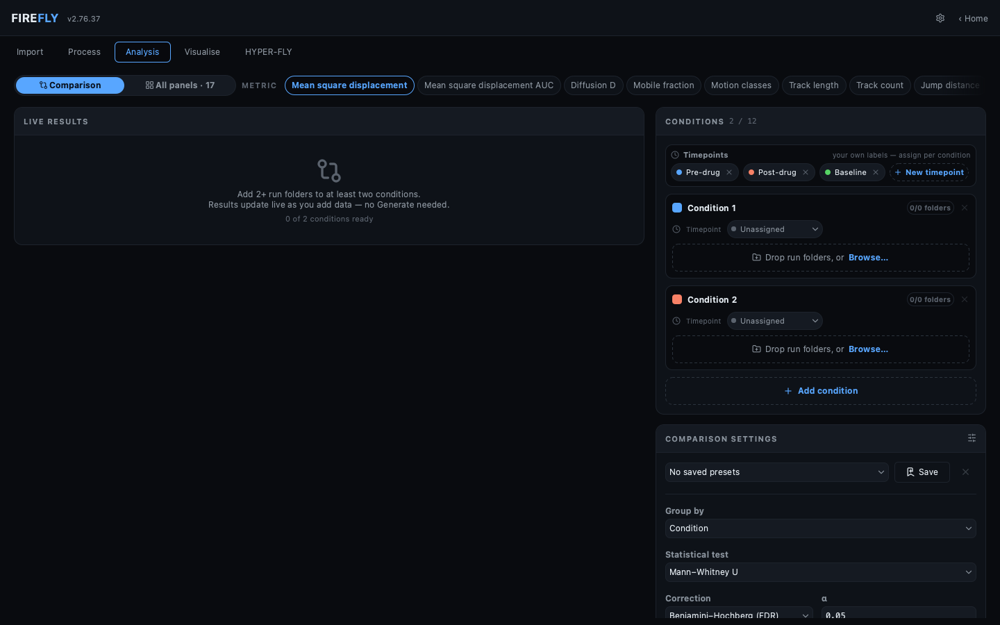

**Visualise** — explore a finished run: every trajectory coloured by motion class
over the cell, with playback, DBSCAN clusters and super-resolution reconstruction.

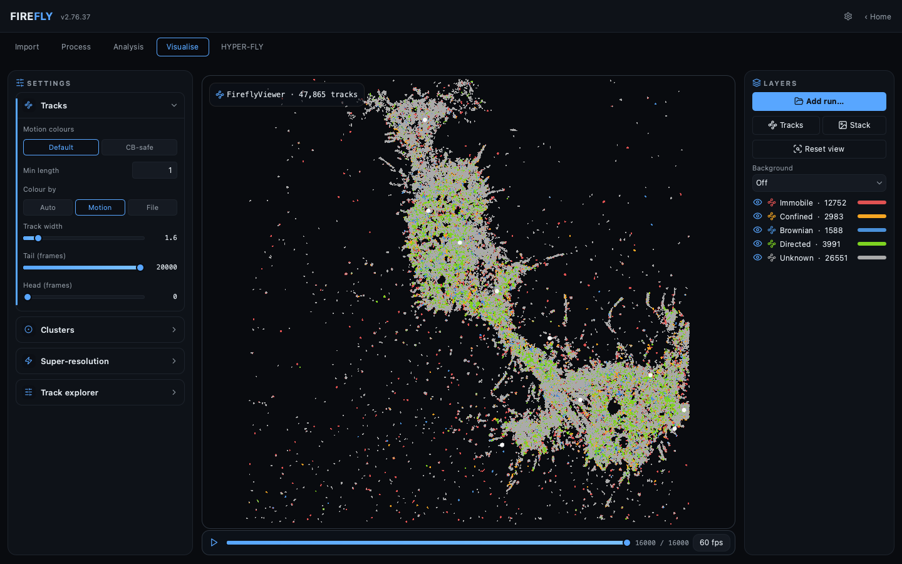

**HYPER-FLY** — on a capable workstation a folder batch fans out across worker
processes, each shown as a live tile with its own preview and progress.

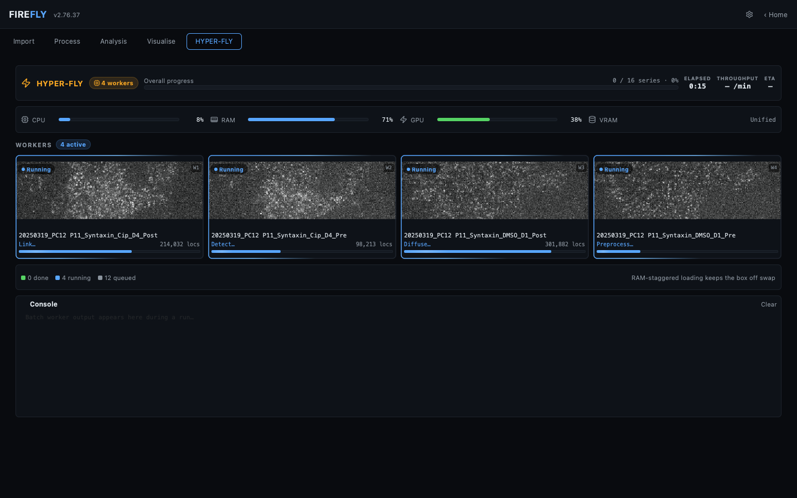

---

## Features

### Detection & tracking

- **Five detection engines** — **trackpy** (CPU) and **PyTorch (GPU)**, both
  Crocker-Grier-family centroid localisers calibrated to agree to within ~5 nm;
  an **à trous wavelet** detector that finds faint spots in low-SNR / structured
  backgrounds; and two alternative GPU sub-pixel refiners that share the same
  Crocker-Grier detection but re-fit each spot's centre — **Gaussian MLE** (a
  maximum-likelihood 2-D Gaussian fit on the raw pixels; Smith et al. 2010) and
  **radial symmetry** (Parthasarathy 2012, closed-form / fit-free). All four GPU
  engines share the refinement-mass scale, so `mass` / `minmass` match across
  them. On isolated, well-bandpassed spots the refiners track centroid-of-mass
  closely (within ~2 % localisation RMSE on the bundled real datasets), with
  small gains at low SNR — they are alternative refiners, not a guaranteed
  precision upgrade. The backend dropdown shows one GPU option per engine that
  auto-selects this machine's GPU — NVIDIA CUDA on Windows/Linux, Apple MPS on
  macOS — and **Auto** prefers the GPU but drops back cleanly to CPU.
- **Selectable linker** — a **Linker** dropdown (Linking panel) chooses the
  trajectory linker (labelled *Algorithm — Software*):
  - **Crocker–Grier — Trackpy** (default) — recursive subnet nearest-neighbour;
    the long-standing, fast linker and the best all-rounder for Brownian motion.
  - **Kalman filter — TrackMate (Linear Motion)** — a constant-velocity
    linear-motion tracker; holds track identities through crossings and directed /
    fast transport where nearest-neighbour linking swaps tracks, and matches
    trackpy on pure diffusion.
  - **Jaqaman LAP — TrackMate** — TrackMate's two-step global assignment
    (frame-to-frame + gap-closing).
  - **Jaqaman LAP — TrackMate (merge/split)** — the above plus optional
    **merge / split** events and intensity feature penalties (TrackMate's full tracker).
  - **Nearest-neighbour — greedy** — greedy per-frame linking (TrackMate's simplest).
  - **Simulated annealing — palmTRACER (inspired)** — a global multi-target
    tracker, an independent reimplementation of palmTRACER's published method.

  Your choice persists between sessions and is recorded in each run's manifest.
- **Auto search-range** — an opt-in checkbox beside the Search-range field
  estimates the linking distance per file from the motion: it sweeps candidate
  ranges and takes the smallest at which tracks stop fragmenting, capped below
  the inter-spot spacing. Off by default; the biggest accuracy win is on fast
  motion, where a fixed default is usually too small.
- **Import external localisations** — analyse `.csv`, `.txt`, or `.tsv`
  localisation tables produced by other software (TrackMate, palmTRACER,
  Picasso, ThunderSTORM) without re-detecting. Column conventions are
  auto-detected. The whole downstream pipeline (linking, MSD, diffusion,
  figures) runs on the imported spots. The visible sidebar pixel size and
  frame interval are authoritative; embedded palmTRACER calibration is retained
  as advisory provenance and disagreements are logged, never silently applied.
  For palmTRACER `.PT` folders you can either **re-analyse** the localisations
  through FIREFLY's pipeline, or **reuse palmTRACER's own per-track D / MSD** to
  draw the matching FIREFLY figures without recomputation (offered for single
  files and batches).
- **Streaming chunked localisation** so large stacks (10⁴+ frames) don't
  need to live in RAM all at once. Each chunk's mass values stream into a
  live histogram on the Analysis tab so a bad threshold is obvious within
  seconds.
- **Live detection preview** during analysis — every preprocessed frame
  flows through a 60 FPS canvas with detected spots overlaid, so you can
  *watch* the pipeline at work.
- **Preview viewer** — a **Preview viewer** button on the Import tab opens a
  floating preview window for the selected file (single file or batch series),
  keeping the tab itself uncluttered. Scrub frames, see detection circles
  colour-coded by integrated mass (turbo on log scale), toggle a
  bandpass-filtered view that shows what the detector actually sees, and
  overlay the auto/manual-threshold ROI mask in real time as you tweak it.
- **Per-file polygon ROIs** drawn directly in the preview viewer, saved
  automatically per file.

### Diffusion & motion analysis

- Per-track MSD with linear-LSQ fits for D and α.
- **Frame-aware lag estimation.** The default **All timestamp pairs** policy
  uses every position pair whose actual frame-number difference equals the
  requested lag, including across missing observations. This is the standard
  [lag-time MSD definition](https://pmc.ncbi.nlm.nih.gov/articles/PMC3055791/)
  and is regression-tested against
  [Trackpy](https://soft-matter.github.io/trackpy/dev/generated/trackpy.motion.imsd.html)
  on gapless tracks. The
  sidebar's **Contiguous observations (legacy)** mode keeps only uninterrupted
  observed runs for compatibility. The policy is persisted in presets,
  manifests, replay state, logs, and per-run metadata.
- Trajectories are stable-sorted by particle/frame before analytics. Duplicate
  `(particle, frame)` rows fail clearly because a particle cannot occupy two
  positions at one timestamp; this commonly indicates a branched TrackMate
  merge/split export that must first be resolved to non-branching tracks.
- `mean_step_um` uses adjacent observations exactly one frame apart.
  `mean_link_displacement_um` covers every adjacent observed localisation, and
  `mean_link_speed_um_s` divides each link by its own `Δframe × Δt` before
  averaging. Track duration is `(max(frame) − min(frame)) × Δt`; localisation
  count and observed sampling time are separate. Path length is the observed
  polyline, so a gap contributes an unknowable-path straight chord.
- Motion classification (Immobile / Confined / Brownian / Directed) with
  configurable α thresholds.
- Tracks whose valid displacement bins are all exactly zero are reported
  separately as `below_resolution`: D and α remain unavailable, their
  α-derived class is unclassified, and they are excluded from log-D and
  mobile/immobile threshold denominators. The excluded count is shown.
- Jump-distance distribution with 1, 2, or 3 mobility populations.
- Mean-squared displacement scaling spectrum (MSS).
- Dwell-time survival curves with exponential τ fit.
- Turning-angle and signed-angle radial distributions; VACF velocities carry
  their true start frame and export a pair count at every lag.
- DBSCAN clustering of localisations with per-cluster area / density.
- New outputs use metrics schema 2 and manifest schema 4. Legacy runs remain
  loadable and explicitly labelled. Stable metrics may still compare, while
  incompatible MSD/D/MSS/VACF or step/speed definitions produce a warning and
  no pooled inference.

### Drift correction

- Redundant cross-correlation (RCC) drift correction (Wang et al. 2014).
- Solves the over-determined `drift[j] − drift[i] = Δᵢⱼ` system across
  every pair of time segments — robust to bad segments, redundancy
  averages out cross-correlation noise.

### ROI handling

Four modes:

- **None** — analyse the whole frame.
- **Auto threshold** — Li / Otsu / Triangle on the normalised mean
  projection.
- **Manual threshold** — drag a slider; the green mask overlay redraws
  live in the preview viewer.
- **Manual polygon** — draw a freehand polygon per file in the preview
  viewer; per-file polygons are remembered.

### Figures

Every run produces a **17-panel analysis figure**. A selection:

<table>
  <tr>
    <td width="33%">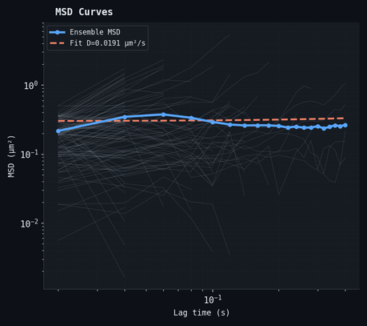</td>
    <td width="33%">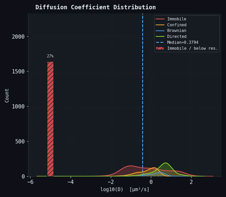</td>
    <td width="33%">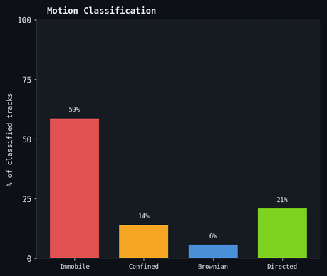</td>
  </tr>
  <tr>
    <td width="33%">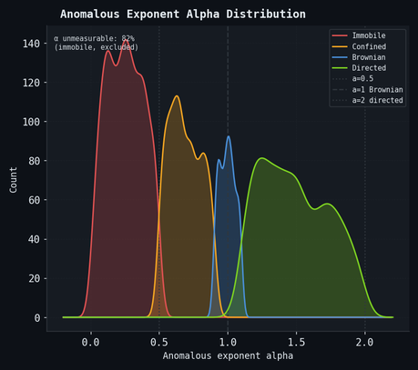</td>
    <td width="33%">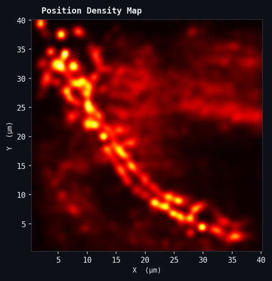</td>
    <td width="33%">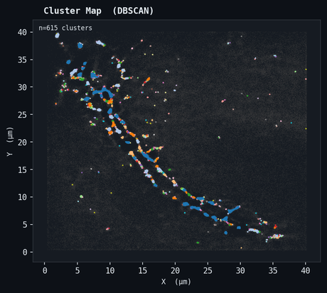</td>
  </tr>
</table>

<sub>Left→right, top→bottom: ensemble MSD (+ anomalous fit) · log₁₀(D) distribution · motion-class breakdown · anomalous-exponent α by class · position-density map · DBSCAN cluster map.</sub>

- Single-sample combined figure with 17 panels (A–Q): max projection,
  trajectories, MSD curves, log₁₀(D) distribution, motion-class
  breakdown, anomalous-exponent distribution, position density, mobile
  fraction over time, JDD with multi-population fit, cluster map,
  dwell-time histogram, MSS slope, radial distribution, van Hove
  displacement distribution (with non-Gaussian α₂), velocity
  autocorrelation (with persistence index), and more.
- Multi-group comparison figure (10 panels: ensemble MSD, log₁₀(D)
  distribution, mobile fraction, motion-class fractions, track-length
  CDF, JDD overlay, dwell-time CDF, turning-angle distribution, radial
  distribution, MSD-AUC bar chart) with automatic statistical-test
  selection (Welch's t / Mann-Whitney U / Welch-ANOVA / Kruskal-Wallis)
  and configurable multiple-comparison correction (Holm by default,
  applied within each metric; across-metric correction is available but
  off by default, so the metric family size is reported in the log).
- Theme picker (**Dark / Light / Publication**) and projection-colormap
  picker (Inferno / Hot / Viridis / Plasma / Greys), with a side-by-side
  live preview that renders synthetic sample / comparison figures at
  440 DPI as you change settings.
- PNG + optional vector PDF + per-panel PNG exports.

### Compare & analyse

- 2–12 conditions (groups of analysis-output folders), optionally arranged
  by time point for group × time-point designs.
- Auto-selects t-test / Mann-Whitney / ANOVA / Kruskal-Wallis based on
  Shapiro-Wilk normality screening.
- Per-replicate scatter dots overlaid on bar charts (when n ≥ 2).
- Significance brackets with stars + numeric p-values.
- Multi-page PDF report: figure, parameter cover, per-replicate scalar
  table, full statistics table.

### Workflow conveniences

- **Reproducibility manifests** — every run writes a self-contained
  `<stem>_run_manifest.json` with FIREFLY version, git SHA, input file
  SHA-256, all parameters, host info. "Load run manifest…" on the Import
  tab replays a run exactly.
- **Parameter presets** — save / load named bundles of sidebar settings
  in `~/.firefly/presets/`. Two ship by default (PC12 Cells, Drosophila
  Neurons) to give new users a sensible starting point.
- **Per-series batch tree** — multi-file series (`name.tif`, `name(1).tif`,
  `name(2).tif`, …) are grouped under one parent node; expand to
  individually deselect sister files within a series. Loader concatenates
  exactly the checked subset in natural numeric order. Direct selection and
  drag/drop accept external `.csv` / `.txt` / `.tsv` localisation tables as
  standalone jobs alongside image stacks. Recursive discovery intentionally
  queues raw `.tif` / `.tiff` / `.czi` images only. Other tools' derived/aux
  files are filtered; corrupt tables remain selected with a visible warning so
  their individual failure is reported while the batch continues.
- **Quality-control panel** — link ratio, locs / frame, median track
  length, gap fraction, stuck-track fraction, with colour-coded warnings
  for runs that look off (e.g. <10 % linked, >800 locs/frame).
- **Resource monitor** — 1 Hz CPU / RAM / GPU / VRAM strip on the
  Analysis tab. On Apple Silicon, GPU% is read live via `ioreg`. Catches
  silent CPU fallbacks instantly.
- **Time-elapsed counter** ticking at 1 Hz during runs (`MM:SS` /
  `H:MM:SS`).
- **Interactive track inspector** on the Visualise tab — click a track
  in the viewer to see its particle ID, length, frame span,
  D, α, motion class, displacement, path length, straightness, mean mass.
- **HYPER-FLY parallel batch** — on a large workstation (**≥ 32 cores and
  ≥ 192 GB RAM**) a folder batch fans out across several files at once in
  parallel worker processes, each with its own live preview tile in a
  dashboard. RAM-staggered loading keeps the box from over-committing memory.
  The controls stay hidden on machines that can't meet the bar.
- **Auto-update check** at launch — non-blocking GitHub Releases ping;
  shows a pill in the header when a newer version is available.
- **Crash reporter** — every uncaught exception writes a detailed report
  (parameters, hardware, pipeline state, traceback) to
  `~/Library/Logs/FIREFLY/crash_reports/` (macOS) or
  `%LOCALAPPDATA%/FIREFLY/crash_reports/` (Windows).

### Memory safety

- Multi-file TIF series → memmap-on-disk when the combined stack would
  exceed available RAM.
- A **4 GB (or 20 % of total RAM)** reserve is held back for the OS and
  the user's other apps so a parallel Safari tab won't push the machine
  into swap mid-analysis. Override with `FIREFLY_USER_RAM_RESERVE_GB=<n>`.
- Live-preview emit is auto-throttled and dropped when free memory falls
  below 1.5 GB.
- Bounded inter-process queue (`maxsize=2000`) so a stalled GUI can't
  back-pressure the worker into swap.

---

## Workflow

### Analyse a sample

1. **Import** tab — pick a `.czi` / `.tif` input file. The preview
   viewer below auto-loads with 30 sampled frames; scrub through them and
   tune the **Diameter**, **Threshold** and **Background radius** in the
   sidebar.
2. Detection circles are coloured by mass (blue = dim, red = bright);
   when you raise threshold the dim ones vanish first.
3. If you want a custom ROI: set **ROI Mode = Manual polygon** in the
   sidebar and draw it on the viewer; it persists per file.
4. Click **Start**. Switch to the **Analysis** tab to watch the live
   detection cockpit (frame + spots) and mass histogram.
5. When done: figure renders to `<output_folder>/figures/`, manifest +
   CSVs to `<output_folder>/`.

### Analyse external localisations

FIREFLY can run its full downstream pipeline on a localisation table that
another tool produced — no re-detection.

1. **Import** tab — under **Localisations file**, browse to a `.csv` /
   `.txt` / `.tsv` exported by TrackMate, palmTRACER, Picasso or
   ThunderSTORM. The **Source preset** dropdown auto-detects the column
   convention (or pick it explicitly).
2. Set pixel size / frame interval in the visible sidebar. Those values are
   authoritative for an external table. If palmTRACER embeds different values,
   FIREFLY records them as advisory metadata and logs the disagreement.
   Optionally point **Background image** at the original stack so the
   figure's projection panel isn't blank.
3. Click **Start**. Detection is skipped; linking (with your chosen linker),
   MSD, diffusion, motion classification and all figures run as normal.

> **palmTRACER `.PT` folders** can be analysed two ways. *Re-analyse with
> FIREFLY* feeds the `locPALMTracer` localisation table through FIREFLY's own
> tracking + diffusion pipeline (FIREFLY's numbers). *Use palmTRACER's own
> MSD/D* instead reads palmTRACER's per-track diffusion (`trcPALMTracer-*-D`)
> and MSD curves (`trcPALMTracer-*-MSD`) and renders the matching FIREFLY
> figures (MSD, ensemble MSD, log₁₀D, D distribution, AUC) from those exact
> values — skipping the expensive re-fit. Metrics palmTRACER doesn't export
> (motion class, JDD, dwell times, turning angles, α) are re-derived from the
> trajectories or marked N/A. FIREFLY never writes into your `.PT` source
> folders.

### Batch a folder

1. **Import** tab → **Batch (folder)** mode.
2. Pick a folder for **image stacks** (`.czi` / `.tif` / `.tiff`), or use
   **Add files** / drag-and-drop for external localisation tables (`.csv`,
   `.txt`, `.tsv`). Images and tables are always separate jobs. A matching CZI
   suppresses TIFF only for that same acquisition. Recognised image companions
   are naturally ordered (`file`, `(1)`, `(2)`, `(10)` and `-fileNNN`);
   localisation tables remain standalone jobs.
   - **Recursive subfolder discovery is raw-image-only** so analysis trees full
     of derived tables are not accidentally re-analysed. Explicitly added
     same-named tables from different folders stay distinct and use
     source-qualified, collision-safe output IDs such as
     `batch_results/Cell1__locPALMTracer/`.
   - palmTRACER's derived files (`trcPALMTracer-*`), visualisation TIFFs
     (`*-Tracks-Z*.tif`), logs and FIREFLY's own outputs are filtered out
     of the queue automatically.
   - **Corrupt/unreadable tables remain selected and are flagged ⚠.** A cheap probe
     run at scan time catches the "full-size on disk but all-null"
     failure mode (aborted acquisition / interrupted copy). The failed job is
     reported clearly and the rest of the batch continues.
   - An **input type** selector switches the scan between **raw images**
     (`.tif` / `.czi`) and **palmTRACER data**; in palmTRACER mode you pick
     **Re-analyse with FIREFLY** or **Use palmTRACER's own MSD/D** (above) for
     the whole batch.
   - An **Output folder** picker sets where results land (defaults to
     `<input>/batch_results/`).
3. Click **Open in viewer** to preview any series before starting
   (the heavy file load only fires here, never on checkbox toggles —
   selecting / deselecting is always instant).
4. Click **Start**. The Analysis cockpit resets between series; each
   gets its own subfolder under the output folder. On a large workstation
   (**≥ 32 cores and ≥ 192 GB RAM**) FIREFLY's **HYPER-FLY** engine runs
   several files in parallel processes with a live per-file tile dashboard;
   smaller machines process one file at a time.

### Compare & analyse

1. **Analysis** tab — drop analysis-output folders into the condition cards,
   one card per condition (e.g. "Pre", "Post" / "WT", "KO", "Rescue"); up to
   **12** conditions, optionally grouped by time point. The figure, statistics
   and significance update **live** as you add data — no Generate step needed.
2. Pick the metric (track length, jump distance, dwell time, turning angle,
   radial distribution, …) from the row of chips along the top; style figures
   in **Preferences → Figures**.
3. **Generate full report** writes the figure + summary CSV + stats CSV +
   multi-page PDF report to the chosen output folder.

### Visualise tracks

1. **Visualise** tab — click **Open run…** and pick an output folder (or
   **Load cluster map…** to open a standalone DBSCAN cluster map).
2. The original stack loads as the background; trajectories overlay as
   tracks auto-coloured by motion class, with playback, fading tails and an
   optional super-resolution layer. DBSCAN clusters can be coloured by motion
   class or cluster ID and re-clustered live (eps / min-samples).
3. Click any track or cluster to populate the inspector with its stats.

---

## Outputs

Each run produces three subfolders inside the output folder plus a
manifest at the root:

```
<output_folder>/
├── <stem>_run_manifest.json       # full provenance — replay with "Load run manifest…"
├── data/                          # PALM-Tracer-compatible CSVs
│   ├── <stem>_localisations.csv
│   ├── <stem>_trajectories.csv
│   ├── <stem>_palm_tracer.csv
│   └── ...
├── firefly_extras/                # everything not in PALM-Tracer format
│   ├── <stem>_diffusion_summary.csv   # D, α, fit status, geometry, duration
│   ├── <stem>_ensemble_msd.csv
│   ├── <stem>_cluster_stats.csv       # one row per DBSCAN cluster
│   ├── <stem>_jdd.json                # JDD fit (D values + fractions)
│   ├── <stem>_van_hove.json           # van Hove distribution + non-Gaussian α₂
│   ├── <stem>_vacf.json               # velocity autocorrelation + persistence
│   ├── <stem>_dwell_times.csv
│   ├── <stem>_turning_angles.csv
│   ├── <stem>_mobile_fraction.csv     # sliding-window mobile fraction
│   ├── <stem>_drift.csv               # (if drift correction enabled)
│   ├── <stem>_params.json             # parameter snapshot for Compare
│   ├── <stem>_summary_metrics.json    # headline metrics + QC flags (1 file)
│   └── <stem>_roi_mask.png            # ROI preview (if enabled)
└── figures/
    ├── <stem>_sptpalm_figure.png      # combined 17-panel figure
    ├── <stem>_sptpalm_figure.pdf      # vector copy (optional)
    └── panels/                        # per-panel exports (optional)
        ├── <stem>_panel_A.png
        ├── <stem>_panel_B.png
        └── ...
```

**Batch mode** wraps the above per-series under
`<input_folder>/batch_results/<stem>/` and adds a `batch_summary.csv`
with one row per series. Each run also writes a self-contained
`firefly_extras/<stem>_summary_metrics.json` (counts, median D/α,
localisation precision, α₂, VACF persistence, mobile fraction and QC
flags), so a whole experiment can be aggregated by globbing those files.
The manifest, params, and summary sidecars also persist the effective
calibration, any embedded advisory calibration, metrics schema, gap policy, and
the step/link/duration definitions used.

**Compare mode** writes:

```
<output_folder>/
├── compare_<labels>.png            # multi-panel comparison figure
├── compare_<labels>.pdf            # vector copy
├── compare_<labels>_summary.csv    # per-replicate scalar metrics
├── compare_<labels>_stats.csv      # statistical tests (pairwise)
└── compare_<labels>_report.pdf     # 4-page PDF: figure + cover + tables
```

---

## Motion & population metrics

Beyond per-track D and α, each run reports several ensemble metrics that
capture structure the per-track averages hide:

- **Localisation precision (`loc_sigma_nm`)** — derived per track from the
  static offset of the MSD fit (`MSD(t) = 4·D·t^α + 4σ²`), so
  `σ = √(MSD₀/4)`. Reported in nm in `diffusion_summary.csv`; a direct read
  of the positional noise floor without a separate immobile-bead calibration.
- **van Hove + non-Gaussian parameter α₂** (`<stem>_van_hove.json`) — the
  pooled single-frame displacement distribution and
  `α₂ = ⟨r⁴⟩ / (2⟨r²⟩²) − 1`. α₂ ≈ 0 for a homogeneous Brownian ensemble and
  grows positive with heterogeneity (e.g. a mobile + trapped mixture) or
  anomalous transport — one scalar for *population* structure.
- **Velocity autocorrelation (VACF)** (`<stem>_vacf.json`) — built from
  single-frame velocities carrying their true start frame. Velocities are
  paired by actual start-frame lag and every exported lag includes its pair
  count. The reported `persistence` (lag-1 value) is ≈ 0 for Brownian motion,
  positive for directed/persistent transport, and negative for
  caged/anti-persistent motion.

> **α identifiability:** when the dynamic term is not identifiable, α is
> reported as `NaN` rather than pinned at a fit bound. A jitter-dominated fit
> may be labelled immobile; an exactly zero-displacement track is instead
> `below_resolution`, has no D/α-derived class, and is excluded from
> D-threshold denominators.

---

## Performance notes

- Use the **uniform-filter** background method unless you have a reason
  to need rolling-ball (uniform is ~1700× faster with comparable
  results for PALM data).
- The **PyTorch** backend on a recent Apple-Silicon / NVIDIA GPU is
  typically 5–20× faster than trackpy on the same machine.
- Chunk size 500 (default) is a good balance. Larger needs more RAM;
  smaller wastes per-chunk overhead.
- DBSCAN is capped at 250 k localisations to keep clustering tractable;
  larger inputs are randomly subsampled before clustering. Spatial
  pattern is preserved.

---

## Troubleshooting

**macOS: "FIREFLY can't be opened because the developer cannot be
verified"**
→ Right-click the app → **Open** → **Open anyway** the first time.

**No particles found / very few trajectories**
→ Lower the PSF diameter by 2 px. Disable **Auto-detect** for threshold
and try smaller values. Check the **channel** index for CZI files.

**Too many trajectories / noise being tracked**
→ Raise threshold. Raise background radius. Enable ROI masking.

**Pixel size or frame interval shows as a warning**
→ Couldn't read the metadata. Tick **Override** and enter the right
value from your acquisition.

**Out of memory during localisation**
→ Reduce chunk size in the Performance section. The loader will
automatically switch to memmap-on-disk when the combined stack exceeds
available RAM minus the user-reserve.

**Run feels slow even with GPU set**
→ Check the resource monitor on the Analysis tab. If GPU% sits at 0,
the backend fell back to CPU — look at the log for the resolver's
verdict. On macOS the **PyTorch (GPU)** backend uses Apple MPS and requires
PyTorch ≥ 2.0 and a recent macOS; without a healthy GPU the resolver uses
PyTorch-CPU. Trackpy is selected automatically only when PyTorch is unavailable.

**Comparison panels show "no data" placeholders**
→ Older analysis folders (pre-v1.0.55) don't have every per-run JSON /
CSV the Analysis tab needs. Re-run the affected experiments to regenerate
the full set. An **incompatible metric contract** warning is deliberate:
legacy/new schemas or gap policies change that metric's meaning, so FIREFLY
withholds pooled inference while keeping stable panels comparable.

**Hard freeze during analysis**
→ Almost always memory pressure or an MPS driver hang. Close other
apps, lower chunk size, and check
`~/Library/Logs/DiagnosticReports/` for a panic log.

**Windows: "Failed to load Python DLL python313.dll" after an update**
→ Fixed in v2.65.6. If you still see it while updating *to* v2.65.6 (the
currently-installed build is what performs the install), the new version is
already in place — just click **OK** and reopen `FIREFLY-Windows.exe`. Every
update from v2.65.6 onward restarts cleanly. The updater log is at
`%LOCALAPPDATA%\FIREFLY\updates\relaunch.log`.

If you hit a crash, FIREFLY writes a full report to
`~/Library/Logs/FIREFLY/crash_reports/` (macOS) or
`%LOCALAPPDATA%/FIREFLY/crash_reports/` (Windows). Attach the report
when reporting the issue.

---

## Acknowledgements

Built on the shoulders of:

- [trackpy](http://soft-matter.github.io/trackpy/) (Allan et al.) —
  Crocker-Grier localisation, linking
- [scikit-image](https://scikit-image.org/) — preprocessing,
  thresholding, morphology
- [scipy](https://scipy.org/), [scikit-learn](https://scikit-learn.org/) —
  statistics, DBSCAN
- [matplotlib](https://matplotlib.org/) — figure rendering
- [PySide6 / Qt 6](https://www.qt.io/) — GUI + QML; the interactive viewers
  are bespoke QGraphicsView / QImage widgets (numpy + matplotlib)
- [PyTorch](https://pytorch.org/) — GPU localisation
- [tifffile](https://github.com/cgohlke/tifffile),
  [aicspylibczi](https://github.com/AllenCellModeling/aicspylibczi) —
  format-specific loaders

Algorithm references:

- Crocker & Grier (1996) — feature detection
- Wang et al. (2014, *Nature Methods*) — RCC drift correction
- Saxton (1997), Yu et al. (2014) — jump-distance distribution
- Ferrari et al. (2001) — moment-scaling spectrum
- Thompson, Larson & Webb (2002) — localisation precision
- Otsu (1979), Li & Lee (1993), Zack-Rogers-Latt (1977) — auto-thresholds
- Ester et al. (1996) — DBSCAN

Developed with AI assistance.
